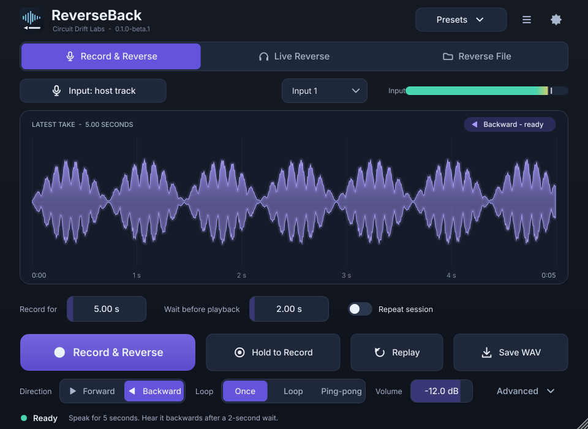
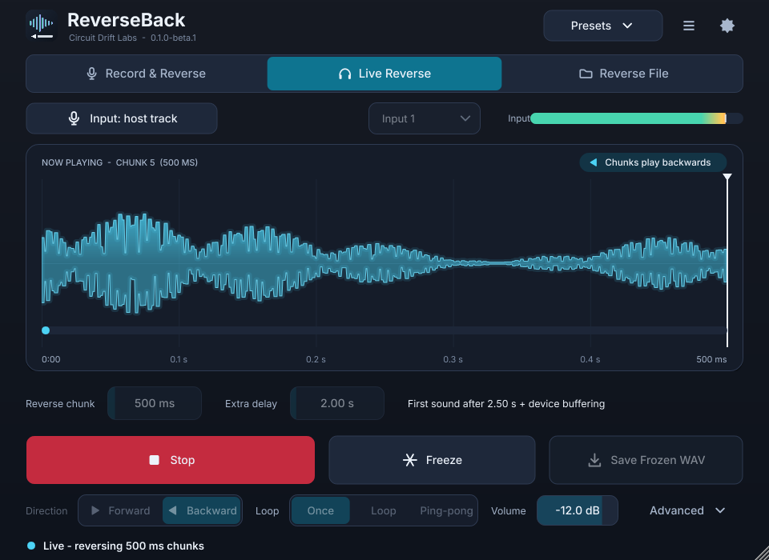
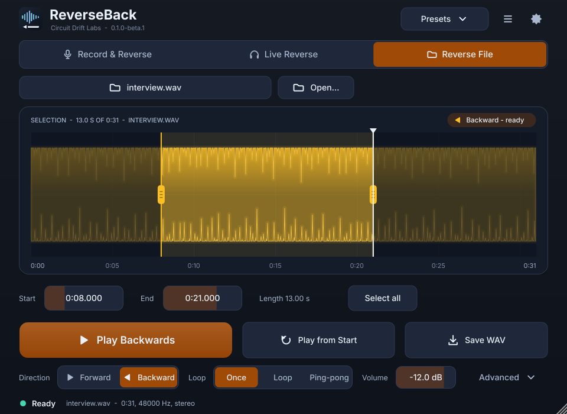
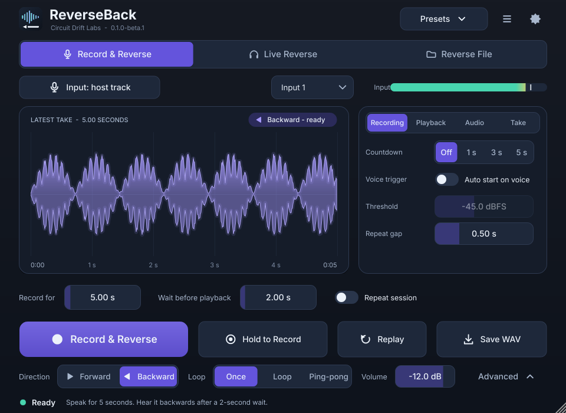
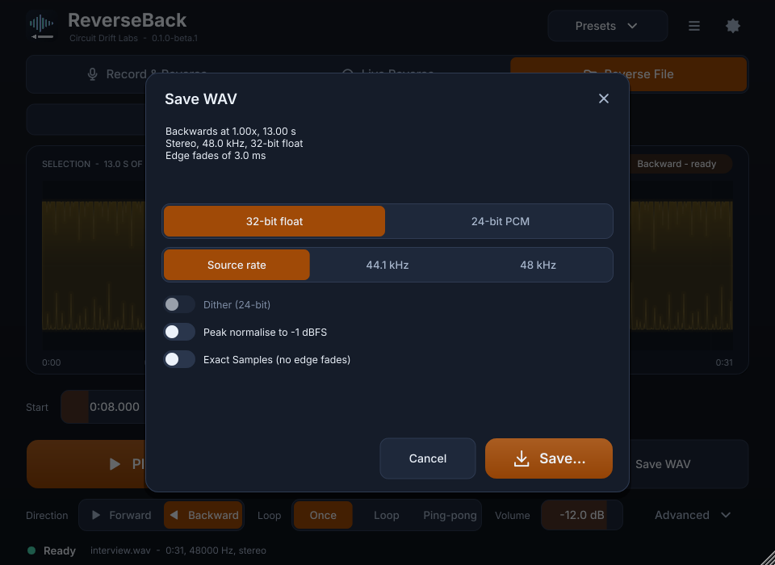

# ReverseBack

A playful local audio toy for reversing your voice, live audio chunks and audio files. Runs as a **standalone app**, a **VST3** effect and a **CLAP** effect (Linux x86_64 and Windows x86_64 builds are produced by CI; the Linux build is the one that has been validated end to end).

**Status: beta (`0.1.0-beta.1`).** All three modes, the full GUI, export, presets and settings are implemented and tested. See [docs/IMPLEMENTATION_STATUS.md](docs/IMPLEMENTATION_STATUS.md) for exactly what has and has not been verified.



| Live Reverse | Reverse File | Advanced drawer | Export |
| --- | --- | --- | --- |
|  |  |  |  |

## Modes

- **Record & Reverse:** record for a chosen time, wait, then hear the complete take backwards. Five seconds of recording plus two seconds of wait starts playback at seven seconds.
- **Live Reverse:** continuously reverse completed chunks, with adjustable chunk size and additional delay. Freeze loops the chunk that is playing; Resume continues live.
- **Reverse File:** load WAV, AIFF or FLAC (mono/stereo, up to 192 kHz and 30 minutes), choose a region, audition it forwards or backwards, loop or ping-pong it, change the tape speed and export the result.

## Extras

Forward/backward comparison, hold-to-record, replay, loops, ping-pong, tape-speed changes, live freeze, voice triggering with pre-roll, countdown, reversible silence trimming, presets and "Surprise me", and WAV/AIFF/FLAC export (float or PCM, with normalise and no silent clipping).

## Download and install (Linux x86_64)

Pick one of the files from the release page:

| File | Contents |
| --- | --- |
| `ReverseBack-<version>-linux-x86_64.tar.gz` | Standalone, VST3, CLAP, `install.sh` / `uninstall.sh` (per-user install, no root) |
| `reverseback_<version>_amd64.deb` | System install: standalone in `/usr/bin`, VST3 in `/usr/lib/vst3`, CLAP in `/usr/lib/clap`, desktop entry |
| `ReverseBack-<version>-linux-x86_64-{standalone,vst3,clap}.zip` | One format each |

```bash
tar -xzf ReverseBack-*-linux-x86_64.tar.gz && cd ReverseBack-*-linux-x86_64 && ./install.sh
```

Runtime needs ALSA (and optionally JACK), X11, FreeType and fontconfig; see `README-linux.txt` inside the archive.

## Build from source

```bash
git clone https://github.com/djshellshoxxx/reverseback.git && cd reverseback
scripts/build-linux.sh            # installs apt dependencies, builds, runs tests, packages into dist/
```

Manual build (JUCE 8.0.15 and clap-juce-extensions are fetched at pinned versions):

```bash
cmake -S . -B build -G Ninja -DCMAKE_BUILD_TYPE=Release
cmake --build build -j
ctest --test-dir build --output-on-failure        # core tests + GUI/plugin tests (xvfb-run is used automatically)
```

Engine only, no JUCE and no network:

```bash
cmake -S . -B build-core -G Ninja -DRB_CORE_ONLY=ON && cmake --build build-core && ctest --test-dir build-core
# sanitizers: -DRB_SANITIZE="address;undefined"   or   -DRB_SANITIZE=thread
```

Release checks for a finished build: `scripts/validate-linux.sh build [path/to/pluginval]`.

## Design documents

- [Product, engine and GUI specification](spec/REVERSEBACK_V1.md) (acceptance tests A01-A20)
- [Engine design](spec/ENGINE_DESIGN.md), [plugin formats](spec/PLUGIN_FORMATS.md) (P01-P12), [GUI design](spec/GUI_DESIGN.md), [build and release](spec/BUILD_RELEASE.md)
- [Implementation status and evidence](docs/IMPLEMENTATION_STATUS.md)

## Layout

```
Source/Core/        framework-free C++20 engine (namespace rb): transports, resampler, clip player, limiter
Source/Audio/       JUCE processor, parameters, state
Source/IO/          file loading (RAM or disk cache), export, settings
Source/UI/          editor, look-and-feel, waveform, sheets
Source/Standalone/  custom standalone application
Tests/              core tests (no JUCE) and integration tests (JUCE, run under Xvfb)
```

## Licence

The ReverseBack source is MIT ([LICENSE](LICENSE)). The compiled binaries link JUCE under its AGPLv3 option, so **the binaries are distributed under AGPL-3.0-or-later** together with the complete corresponding source (this repository at the release tag). See [THIRD_PARTY_LICENSES.md](THIRD_PARTY_LICENSES.md) and [LICENSES/](LICENSES). Trademarks: see [COPYRIGHT-TRADEMARK.md](COPYRIGHT-TRADEMARK.md). VST is a trademark of Steinberg Media Technologies GmbH.
